# NexusSMM — Workflow Chi Tiết Người Dùng & Admin

> **Stack**: Express + Prisma + MySQL (`rent_ai_suport`) + RabbitMQ + Argon2 + JWT + Vite/React

---

## 🗺️ Sơ đồ Kiến trúc Tổng quan

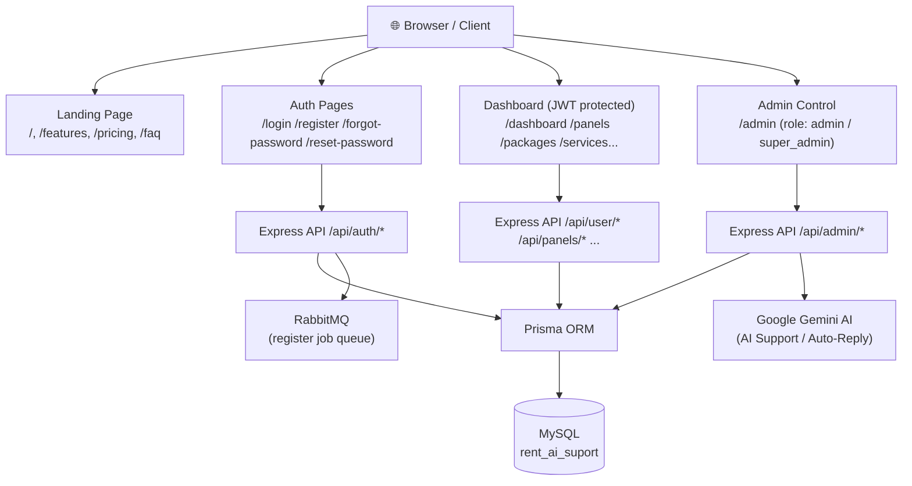

---

## 👤 PHẦN 1 — NGƯỜI DÙNG (Customer / Support)

### 1.1 Auth — Xác thực

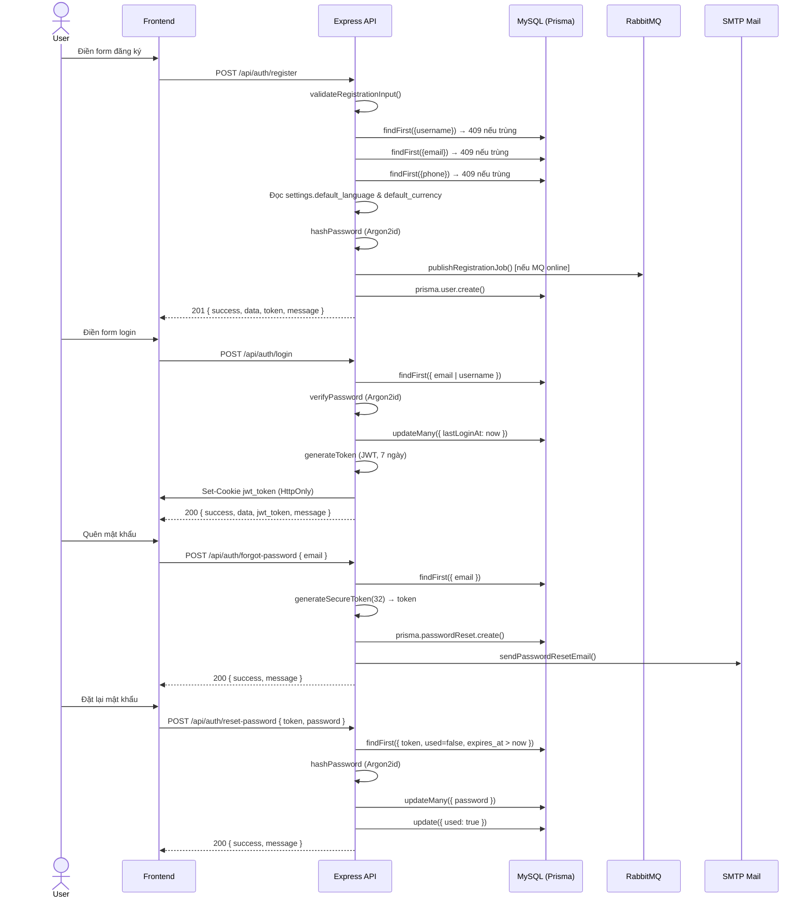

| Endpoint | Method | Mô tả |
|---|---|---|
| `/api/auth/register` | POST | Đăng ký, kiểm tra trùng username→email→phone |
| `/api/auth/login` | POST | Login bằng email hoặc username |
| `/api/auth/logout` | POST | Xóa cookie jwt_token |
| `/api/auth/forgot-password` | POST | Gửi email reset |
| `/api/auth/reset-password` | POST | Đặt mật khẩu mới qua token |
| `/api/auth/me` hoặc `/api/user/profile` | GET | Lấy thông tin user hiện tại |

**Fields đăng ký:**
```json
{
  "name": "Nguyen Van A",         // bắt buộc, 2-100 ký tự
  "username": "nguyenvana",       // bắt buộc, 3-30 ký tự, a-z 0-9 _
  "email": "user@gmail.com",      // bắt buộc, email hợp lệ
  "password": "MatKhau@2026",     // bắt buộc, >= 8 ký tự
  "phone": "+84988889999",        // tùy chọn, UNIQUE
  "role": "customer"              // tùy chọn: customer|admin|support|super_admin
}
```

**Response đăng ký thành công (201):**
```json
{
  "success": true,
  "data": {
    "id": 1,
    "role": "customer",
    "balance": 15,
    "language": "en",       ← lấy từ settings.default_language
    "currency": "USD",      ← lấy từ settings.default_currency
    "apiKey": "<64 ký tự hex random>",
    "emailVerified": true
  },
  "token": "<JWT>",
  "message": "Đăng ký thành công! Tặng ngay $15.00..."
}
```

---

### 1.2 Profile — Hồ sơ tài khoản

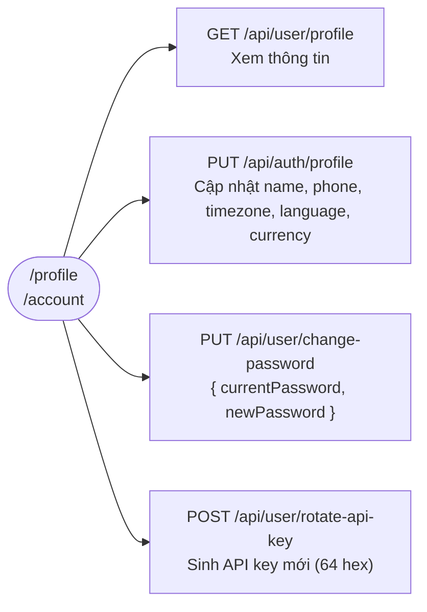

| Endpoint | Method | Mô tả |
|---|---|---|
| `/api/user/profile` | GET | Xem profile |
| `/api/auth/profile` hoặc `/api/user/profile` | PUT | Sửa name, phone, timezone, language, currency |
| `/api/user/change-password` | PUT | Đổi mật khẩu (cần xác nhận mật khẩu hiện tại) |
| `/api/user/rotate-api-key` | POST | Tạo lại API key (64-char hex random, không có prefix) |

---

### 1.3 Dashboard — Tổng quan

**Route:** `/dashboard`  
**API:** `GET /api/dashboard/stats`

Hiển thị:
- Số dư tài khoản (balance)
- Số panel đang hoạt động
- Tổng đơn hàng
- Doanh thu tháng này
- Biểu đồ hoạt động 7 ngày
- Thông báo hệ thống
- Subscription đang chạy

---

### 1.4 Panels — Quản lý Panel SMM

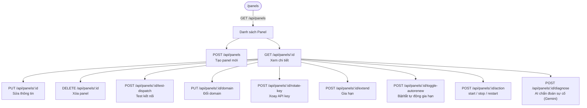

**Trạng thái panel:** `active` | `suspended` | `pending` | `expired`

---

### 1.5 Services — Dịch vụ SMM

**Route:** `/services`

| Endpoint | Method | Mô tả |
|---|---|---|
| `GET /api/services` | GET | Xem danh sách dịch vụ (Instagram, Facebook, TikTok...) |
| `POST /api/services` | POST | Đặt dịch vụ mới |
| `PUT /api/services/:id` | PUT | Cập nhật đơn |
| `DELETE /api/services/:id` | DELETE | Hủy dịch vụ |

---

### 1.6 Packages — Gói dịch vụ

**Route:** `/packages`  
**API:** `GET /api/packages`

Hiển thị các gói subscription với giá và tính năng. Người dùng chọn gói → chuyển sang thanh toán.

---

### 1.7 Billing — Thanh toán & Số dư

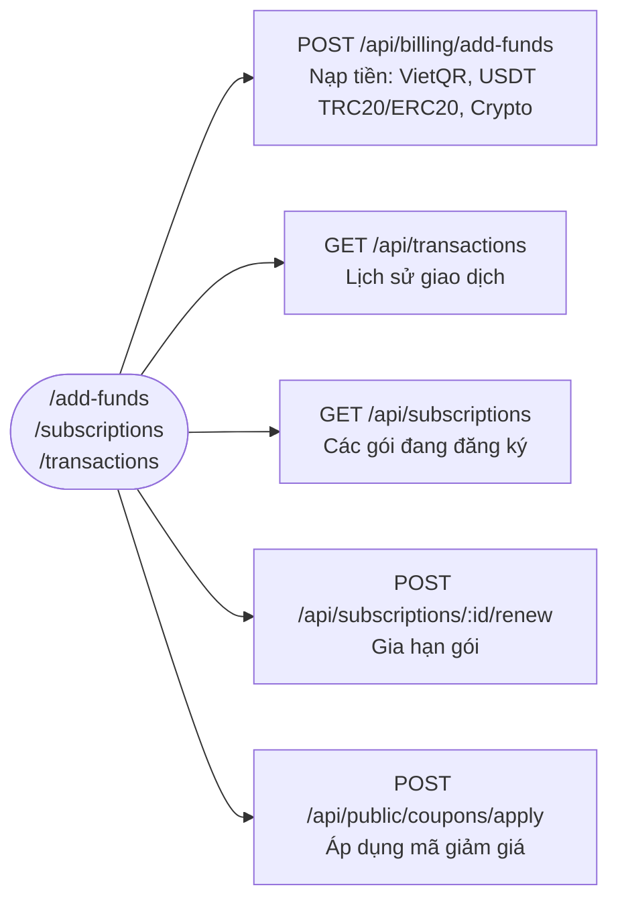

**Phương thức nạp tiền:**
- 🏦 VietQR (MBBANK, tự động xác minh)
- ₿ USDT TRC20 / ERC20
- 💳 Crypto tự động xác nhận sau N blocks

---

### 1.8 Dispatch — Cấu hình Điều phối đơn

**Route:** `/dispatch`

Cấu hình cách hệ thống tự động điều phối đơn hàng sang các provider SMM.

---

### 1.9 Support — Hỗ trợ AI

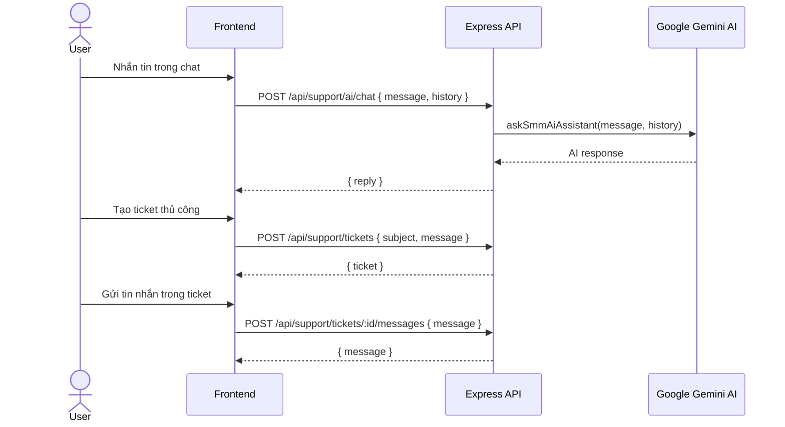

| Endpoint | Method | Mô tả |
|---|---|---|
| `POST /api/support/ai/chat` | POST | Chat với AI (Gemini) |
| `GET /api/support/tickets` | GET | Danh sách ticket |
| `POST /api/support/tickets` | POST | Tạo ticket mới |
| `POST /api/support/tickets/:id/messages` | POST | Gửi tin nhắn trong ticket |

---

### 1.10 Notifications — Thông báo

| Endpoint | Method | Mô tả |
|---|---|---|
| `GET /api/notifications` | GET | Lấy danh sách thông báo |
| `PUT /api/notifications/read-all` | PUT | Đánh dấu tất cả đã đọc |

---

## 🛡️ PHẦN 2 — ADMIN (`role: admin` hoặc `super_admin`)

**Route:** `/admin`  
**Component:** `AdminControlPage.tsx`

### 2.1 Admin Tabs Overview

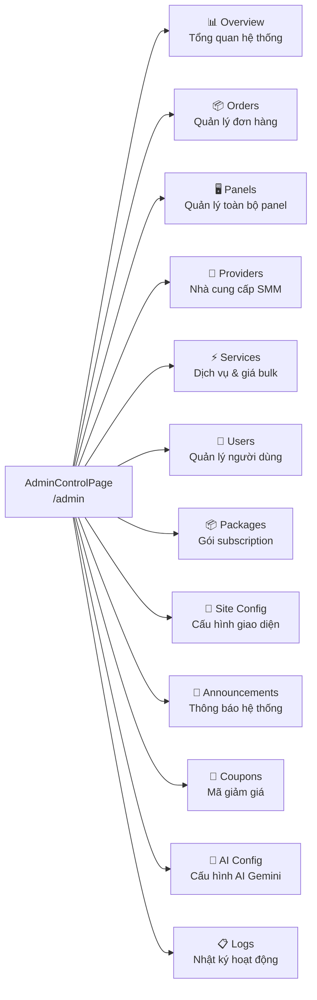

---

### 2.2 Overview — Tổng quan hệ thống

| Endpoint | Mô tả |
|---|---|
| `GET /api/admin/stats` | Thống kê: tổng user, doanh thu, đơn hàng, tỉ lệ thành công |
| `GET /api/admin/overview` | Chi tiết: biểu đồ, top users, top panels, alerts |

---

### 2.3 Orders — Quản lý đơn hàng

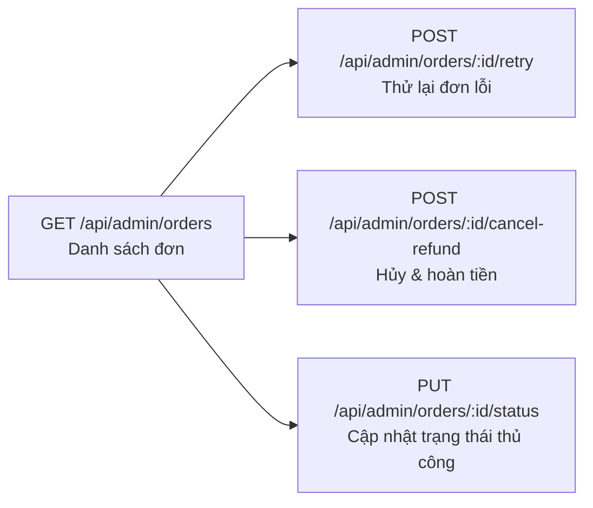

**Trạng thái đơn:** `pending` | `processing` | `completed` | `failed` | `cancelled`

---

### 2.4 Users — Quản lý người dùng

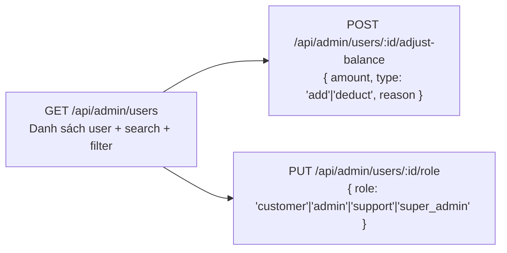

**Khả năng:**
- Xem toàn bộ danh sách user (có phân trang, tìm kiếm)
- Điều chỉnh số dư (cộng/trừ, ghi lý do)
- Thay đổi role của user
- Xem lịch sử đăng nhập (`lastLoginAt`)

---

### 2.5 Panels — Quản lý Panel (Admin)

| Endpoint | Method | Mô tả |
|---|---|---|
| `GET /api/admin/panels` | GET | Xem tất cả panel của mọi user |
| `POST /api/admin/panels/create` | POST | Admin tạo panel cho user bất kỳ |
| `PUT /api/admin/panels/:id` | PUT | Sửa panel |
| `POST /api/admin/panels/:id/extend` | POST | Gia hạn panel |
| `DELETE /api/admin/panels/:id` | DELETE | Xóa panel |

---

### 2.6 Providers — Nhà cung cấp SMM

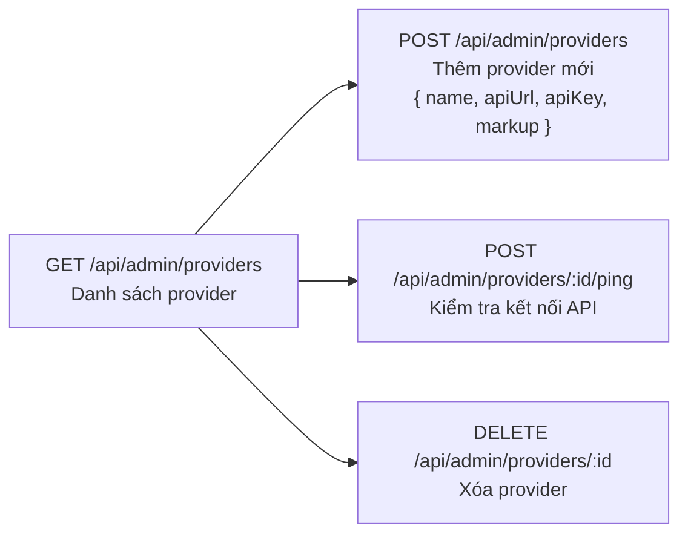

---

### 2.7 Services — Dịch vụ & Giá (Admin)

| Endpoint | Method | Mô tả |
|---|---|---|
| `POST /api/admin/services/bulk-price` | POST | Cập nhật giá hàng loạt theo % markup |

---

### 2.8 Packages — Gói Subscription (Admin)

| Endpoint | Method | Mô tả |
|---|---|---|
| `PUT /api/admin/packages/:id` | PUT | Sửa thông tin gói (giá, tính năng, thời hạn) |

---

### 2.9 Site Config — Cấu hình giao diện

| Endpoint | Method | Mô tả |
|---|---|---|
| `GET /api/admin/site-config` | GET | Lấy cấu hình site |
| `PUT /api/admin/site-config` | PUT | Cập nhật: logo, màu sắc, tên site, SEO, custom CSS |
| `GET /api/public/site-config` | GET | Lấy cấu hình (public, không cần auth) |

---

### 2.10 Announcements — Thông báo hệ thống

| Endpoint | Method | Mô tả |
|---|---|---|
| `GET /api/admin/announcements` | GET | Danh sách thông báo |
| `POST /api/admin/announcements` | POST | Tạo thông báo mới |
| `PUT /api/admin/announcements/:id` | PUT | Sửa thông báo |
| `DELETE /api/admin/announcements/:id` | DELETE | Xóa thông báo |
| `GET /api/public/announcements` | GET | Public endpoint (banner hiển thị cho mọi user) |

---

### 2.11 Coupons — Mã giảm giá

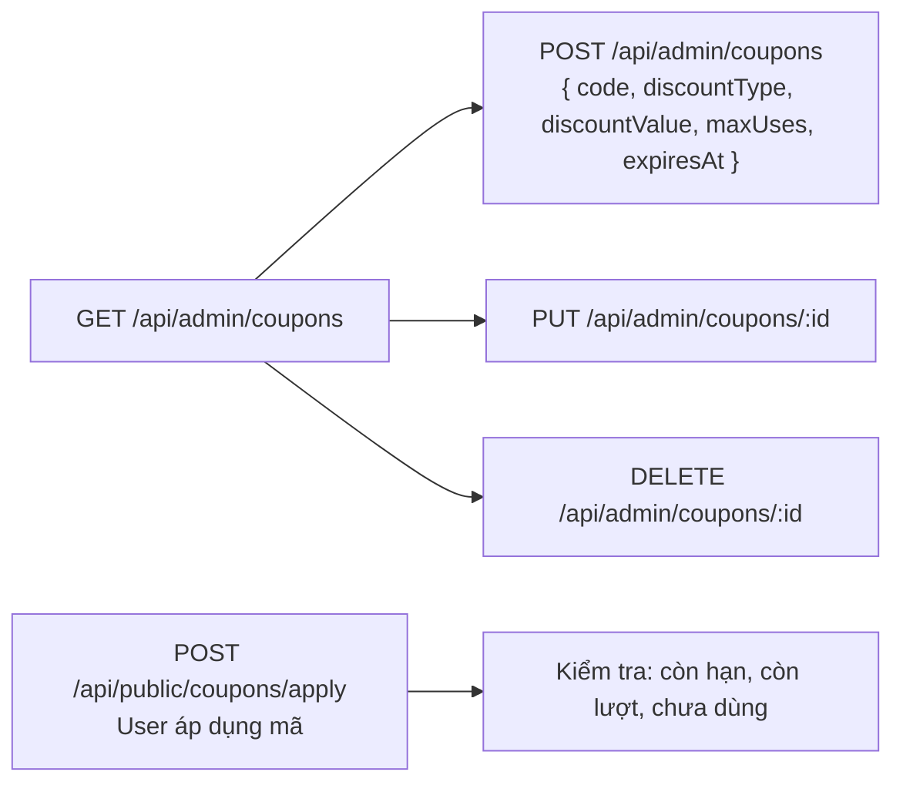

**Loại giảm giá:** `percent` (%) | `fixed` (số tiền cố định)

---

### 2.12 System Settings — Cài đặt hệ thống

| Endpoint | Method | Mô tả |
|---|---|---|
| `GET /api/admin/system/settings` | GET | Đọc settings |
| `PUT /api/admin/system/settings` | PUT | Cập nhật: SMTP, tỉ giá, cổng thanh toán, default_language, default_currency... |
| `POST /api/admin/system/purge-cache` | POST | Xóa cache hệ thống |
| `POST /api/admin/system/sync-all-providers` | POST | Đồng bộ dịch vụ từ tất cả provider |

**Các cài đặt quan trọng trong `settings` table:**

| Trường | Mô tả |
|---|---|
| `default_language` | Ngôn ngữ mặc định khi đăng ký user mới |
| `default_currency` | Tiền tệ mặc định khi đăng ký user mới |
| `usd_to_vnd_rate` | Tỉ giá USD/VND |
| `min_deposit_usd` | Nạp tối thiểu (USD) |
| `allow_user_registration` | Bật/tắt đăng ký |
| `maintenance_mode` | Bật/tắt bảo trì |
| `vietqr_bank_code` | Mã ngân hàng VietQR |
| `vietqr_account_number` | Số tài khoản |
| `smtp_host/port/username/password` | Cấu hình email |

---

### 2.13 AI Config — Cấu hình Gemini AI

| Endpoint | Method | Mô tả |
|---|---|---|
| `GET /api/admin/ai-config` | GET | Xem cấu hình AI |
| `PUT /api/admin/ai-config` | PUT | Cập nhật: model, system_prompt, temperature, max_daily_tokens |

**Models hỗ trợ:** `gemini-2.5-flash`, `gemini-2.0-flash`, `gemini-1.5-pro`

---

### 2.14 Audit Logs — Nhật ký hoạt động

| Endpoint | Method | Mô tả |
|---|---|---|
| `GET /api/admin/audit-logs` | GET | Xem log: USER_REGISTER, LOGIN, PANEL_CREATE, BALANCE_ADJUST... |

---

## 🗄️ PHẦN 3 — DATABASE SCHEMA

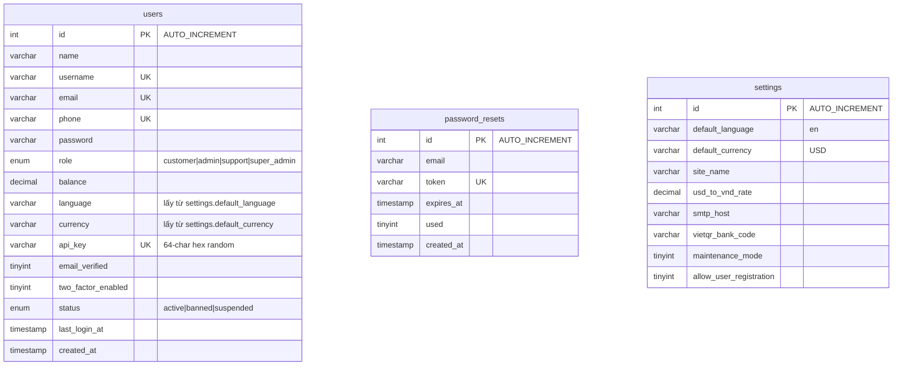

---

## 🔐 PHẦN 4 — BẢO MẬT

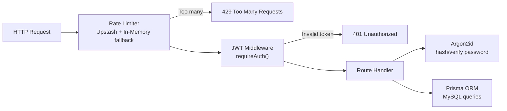

| Cơ chế | Công nghệ |
|---|---|
| Hash mật khẩu | `@node-rs/argon2` (Argon2id) |
| JWT Token | `jsonwebtoken`, 7 ngày, HttpOnly Cookie |
| Rate Limiting | Upstash Redis + In-Memory fallback |
| API Key | 64-char hex random (không có prefix cố định) |
| Queue dedup | RabbitMQ (fallback: direct execution) |
| DB ORM | Prisma v6.4.1 → MySQL |

---

## 📋 PHẦN 5 — LUỒNG HOÀN CHỈNH KHI ĐĂNG KÝ

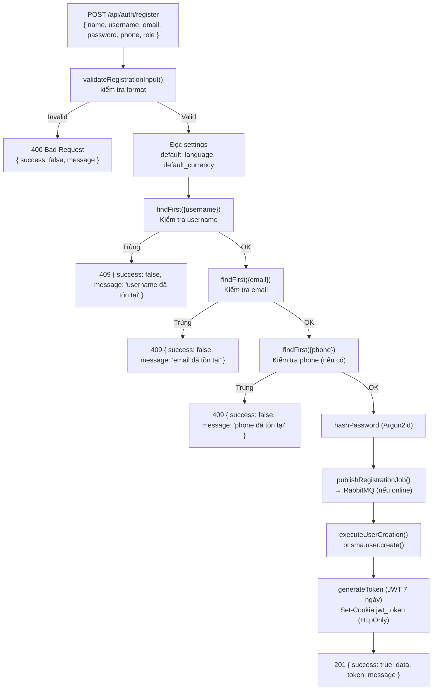

---

## PHẦN 6 — REST API IMPLEMENTATION CHECKLIST

Backend Express hiện tổ chức theo tài nguyên REST: resource dùng danh từ số nhiều, HTTP method biểu diễn thao tác, route handler xử lý request/response và Prisma là nguồn dữ liệu duy nhất. Không dùng dữ liệu seed/static trong `src/server/db.ts`.

- Auth: `POST /api/auth/register`, `POST /api/auth/login`, `POST /api/auth/forgot-password`, `POST /api/auth/reset-password`, `POST /api/auth/logout`, `GET /api/auth/me`.
- User, panels, services, billing, support, notifications và admin đều dùng route theo resource.
- Route bảo mật phải gọi `requireAuth`; route admin phải kiểm tra `admin|super_admin`.
- Request body phải validate trước khi gọi Prisma; response thống nhất `{ success, data?, message? }`.
- JWT chỉ lưu trong HttpOnly cookie `jwt_token`; password dùng Argon2id; login/register/reset có rate limit.
- File `panel/postman.txt` chứa mẫu request cho toàn bộ route hiện có, dùng biến `{{baseUrl}}` và cookie đăng nhập.

### Chạy và kiểm tra
```bash
cd panel
npm run lint
npm run dev
```
Sau khi đăng nhập trong Postman, bật cookie jar để các request protected tự gửi `jwt_token`. Thay `:id` bằng ID thực tế trả về từ API trước đó.
